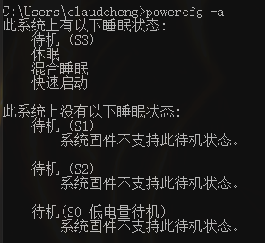
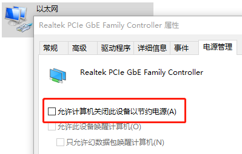
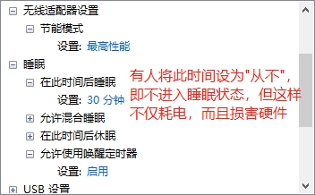
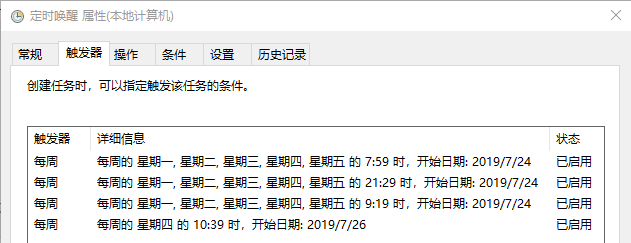

# 需要node环境

[nodejs官网](https://nodejs.org/en/)  

# 模块依赖

// TODO

# Windows计划任务

1. 在开机时自动运行[机器人任务脚本](./start.bat)于后台中  
2. 在系统睡眠时执行[唤醒脚本](./weak.bat)，避免因系统睡眠时断网造成机器人任务失败  

[win10 计划任务中加入bat文件执行](https://blog.csdn.net/langqingj/article/details/80974632)  

## 要点

windows系统有着多种睡眠状态：待机、休眠、睡眠……其区别可以参考[Windows系统中睡眠、休眠、待机、混合睡眠的解释说明](https://qq370079140.iteye.com/blog/2367134)。另外可以在命令行输入`powercfg -a`查看当前的睡眠状态  
  

由于睡眠状态下内存以外的设备都将断电，就需要利用windows自带的**计划任务**唤醒计算机，以退出睡眠模式  

1. 需要修改[网络适配器]->[属性]->[配置]->[电源管理]，**关闭“允许计算机关闭此设备以节约电源”**  
  
2. 确认[电源选项]->[更改计划设置]->[更改高级电源设置]中，**节能模式设置为最高性能**，以及**允许使用唤醒定时器**  
  
3. 添加唤醒计划任务，具体步骤网上很多教程就不多说了。不过要注意一点，亲测从睡眠状态唤醒的计算机只会保持**2分钟左右**的非睡眠状态，所以触发器的时间最好在任务执行时间点前一分钟内。目前还不知道可否改变唤醒后的非睡眠时常，待调查  

# 接口

[免费天气api接口](https://www.kancloud.cn/ccjin/yingq)  
[随机图片](https://www.v2ex.com/t/565252)  

# 其他工具

[base64图片在线转换工具](http://tool.chinaz.com/tools/imgtobase/)  
[Linux中文件MD5校验](https://www.cnblogs.com/f-ck-need-u/p/7430264.html)  
